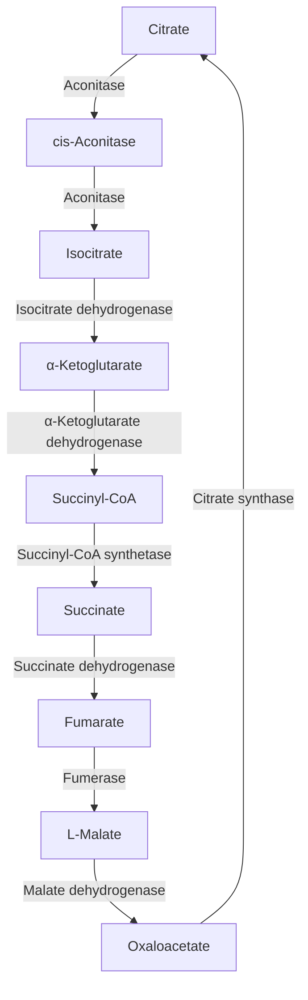
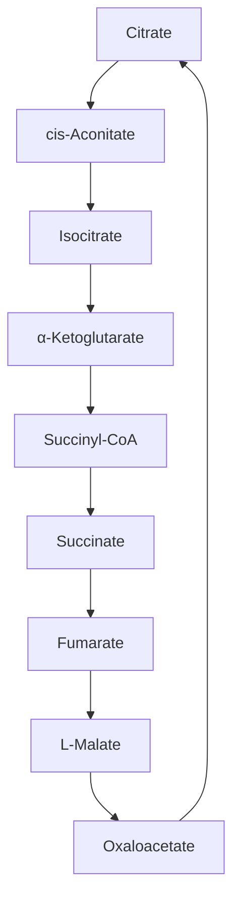

## Introduction

- Tricarboxylic Acid Cycle 
- Mitochondria

---

## TCA

---

### Quantitative description of protein-ligand interactions 

Function in biochemistry often revolves around a reversible protein-ligand interaction.
$$
P + L \rightleftharpoons PL 
$$

$$
K_a = \frac{[PL]}{[P][L]} \\
$$
A higher value of $K_a$ corresponds to a higher affinity of the ligand for the protein. 

$$
K_a[L] = \frac{[PL]}{[P]}
$$
The ratio of bound to free protein is directly proportional to the concentration of free ligand.

---

### Occupancy of ligand-binding sites

$$
\theta = \frac{\text{Binding sites occupied}}{\text{Total binding sites}} = \frac{[PL]}{[PL] + [P]} 
$$

Substituting $K_a[L][P]$ for $[PL]$
$$
\theta = \frac{K_a[L][P]}{K_a[L][P] + [P]} = \frac{K_a[L]}{K_a[L] + 1} = \frac{[L]}{[L] + \frac{1}{K_a}}
$$

The value of $K_a$ can be determined from a plot of $\theta$ versus the concentration of free ligand, [L].

The [L] at which half of the available ligand-binding sites are
occupied (at $\theta$ = 0.5) corresponds to $\frac{1}{K_a}$.

{width="400"}

---

### Dissociation constant

$K_d$ is the equilibrium constant for the release of ligand.

$$
K_d = \frac{[P][L]}{[PL]} \\
[PL] = \frac{[P][L]}{K_d} \\
$$

$$
\theta = \frac{[L]}{[L] + K_d}
$$
When $[L]$ is equal to $K_d$, half of the ligand-binding sites are occupied.

As $[L]$ falls below $K_d$, progressively less of the protein has ligand bound to it.
 
In order for 90% of the available ligand-binding sites to be occupied, $[L]$ must be nine times greater than $K_d$. 

---

### Dissociation constant

$K_d$ is used much more often than $K_a$ to express the affinity of a protein for a ligand.

A lower value of $K_d$ corresponds to a higher affinity of the ligand for the protein.

$K_d$ is equivalent to the molar concentration of ligand at which half of the available ligand-binding sites are occupied.

At this point, the protein is said to have reached half-saturation with respect to ligand binding.

The more tightly a protein binds a ligand, the lower the concentration of ligand required for half the binding sites to be occupied, and thus the lower the
value of $K_d$.

---

### Protein structure affects ligand binding

The interaction is greatly affected by protein structure and is often accompanied by conformational changes.

Carbon monoxide binds to free heme molecules more than 20,000 times better than does O2 (that is, the $K_d$ or P50 for CO binding to free heme is more than 20,000 times lower than that for O2).

CO binds only about 200 times better when the heme is bound in myoglobin.

The _distal His_ (His64 E7), does not affect the binding of O2 but may preclude the linear binding of CO.

A reduction in CO binding is physiologically important, because CO is a low-level byproduct of cellular metabolism.

{width="325"}

---

### Enzymes - Introduction

Much of the history of biochemistry is the history of enzyme research.

Biological catalysis was first recognized and described in the late 1700s,

In 1897, Eduard Buchner discovered that yeast extracts could ferment sugar to alcohol, proving that fermentation was promoted by molecules that continued to function when removed from cells. 

<aside class="notes">
German physiologist FWK - ancient greek.

As vitalistic notions of life were disproved, the isolation of new enzymes and the investigation of their properties advanced the science of biochemistry.
</aside>

Frederick W. Kühne called these molecules __enzymes__.

ἐν (en, “in”) +‎ ζύμη (zúmē, “sourdough”)

A substance produced by a living organism which acts as a catalyst to bring about a specific biochemical reaction.

---

### Most enzymes are proteins

James Sumner found that urease crystals consisted entirely of protein, and he postulated that all enzymes are proteins.

In 1930, J. B. S. Haldane made the remarkable suggestion that weak bonding interactions between an enzyme and its substrate might be used to catalyze a reaction.

With the exception of a small group of catalytic RNA molecules, all enzymes are proteins.

Their catalytic activity depends on the integrity of their native protein conformation.

Some enzymes require no chemical groups for activity other than their amino acid residues.

An additional chemical component called a __cofactor__—either one or more inorganic ions or a complex organic or metalloorganic molecule called a __coenzyme__.

{width="325"}

---

### Cofactors and coenzymes

Some enzymes require both a coenzyme and a cofactor for activity.

A coenzyme or metal ion that is very tightly or even covalently bound to the enzyme protein is called a __prosthetic group__.

A complete, catalytically active enzyme together with its bound coenzyme and/or metal ions is called a __holoenzyme__. 

The protein part of such an enzyme is called the __apoenzyme__ or __apoprotein__.

Coenzymes act as transient carriers of specific functional groups. 

Most are derived from vitamins, organic nutrients required in small amounts in the diet. 

Some enzymes are modified covalently by phosphorylation, glycosylation,
and other processes. 

Many of these alterations are involved in the regulation of enzyme activity.

---

### Enzyme Classification

Many enzymes have been named by adding the suffix “-ase” to the name of their substrate or to a word or phrase describing their activity.

<aside class="notes">
Thus urease catalyzes hydrolysis of urea, and DNA polymerase catalyzes the polymerization of nucleotides to form DNA.

An enzyme known to act in the digestion of foods was named pepsin, from the Greek pepsis, “digestion,” and lysozyme was named for its ability to lyse bacterial cell walls.

Transfer of a phosphoryl group from ATP to glucose.

Number 2 denote class name (transferase); the second number (7), the subclass (phosphotransferase); the third number (1), a phosphotransferase with a hydroxyl group as acceptor; and the fourth number (1), D-glucose as the phosphoryl group acceptor. For many enzymes, a trivial name is more commonly used—in this case hexokinase.
</aside>

Each enzyme is assigned a four-part classification number and a systematic name, which identifies the reaction it catalyzes.

$$
\text{ATP} + \text{D-glucose} \rightarrow \text{ADP} + \text{D-glucose-6-phosphate}
$$

Enzyme name: __ATP:glucose phosphotransferase__ &nbsp;&nbsp;&nbsp;&nbsp; E.C. number __2.7.1.1__

---

### How enzymes work

Under biologically relevant conditions, uncatalyzed reactions tend to be slow—most biological molecules are quite stable in the neutral-pH, mild temperature, aqueous environment inside cells.

Many common reactions in biochemistry entail chemical events that are unfavorable or unlikely in the cellular environment, such as the transient formation of unstable charged intermediates or the collision of two or more molecules in the precise orientation required for reaction.

An enzyme circumvents these problems by providing a specific environment within which a given reaction can occur more rapidly. 

The distinguishing feature of an enzyme-catalyzed reaction is that it takes place within the confines of a pocket on the enzyme called the __active site__.

Often, the active site encloses a __substrate__, sequestering it completely from solution.

---

### Enzyme action

$$
E + S \rightleftharpoons ES \rightleftharpoons EP \rightleftharpoons E + P
$$

The function of a catalyst is to increase the __rate__ of a reaction. Catalysts do not affect reaction __equilibria__.

The free energy of the ground state of P is lower than that of S, so $\Delta\text{G}^{′°}$ for the reaction is negative and the equilibrium favors P.

A favorable equilibrium does not mean that the S $\rightarrow$ P conversion will occur at a detectable rate (energy “hill” ).

The difference between the energy levels of the ground state and
the transition state is the __activation energy, $\Delta\text{G}$‡__.

Catalysts enhance reaction rates by lowering activation energies.

---

##### Substrate Concentration Affects the Rate of Enzyme-Catalyzed Reactions

Initial rate (__V0__), when [S] >> [E].

$$
E + S \rightleftharpoons ES \;\;\;\;\;\; \text{(fast)}\\
ES \rightleftharpoons E + P \;\;\;\;\;\; \text{(slow)}
$$

The reaction quickly achieves a steady state in which [ES] remains approximately constant over time (__steady-state kinetics__).

$$
E + S \underset{k_{-1}}{\stackrel{k_1}{\rightleftharpoons}} ES \underset{}{\stackrel{k2}{\rightarrow}} E + P
$$

<aside class="notes">
Assumption, P to S is ignored i.e. no k-2.

V0 is determined by the breakdown of ES to form product, which is determined by [ES]
</aside>

$$
V_o = k_2 [ES]
$$

[ES] can not be easily measured experimentally.

---

### Enzyme kinetics

$$
\text{Rate of ES formation = } k_1 ([E_t] - [ES])[S] \\
\text{Rate of ES breakdown = } k_{-1} [ES] + k_2 [ES]
$$

__Steady-state assumption:__ Rate of formation of ES is equal to the rate of its breakdown.
$$
k_1 ([E_t] - [ES])[S] =  k_{-1} [ES] + k_2 [ES]
$$

$$
[ES] =  \frac{[E_t][S]}{[S] + (k_2 + k_{-1})/k_1}
$$

$$
[ES] =  \frac{[E_t][S]}{K_m + [S]}
$$
$K_m$ is __Michaelis constant__.

---

### Michaelis-Menten Equation

Expressing $V_0$ in terms of $[ES]$.
$$
V_0 =  \frac{k_2 [E_t][S]}{K_m + [S]}
$$

Maximum velocity occurs when the enzyme is saturated (i.e. $[ES] = [E_t]$).

$$
V_0 =  \frac{V_{max} [S]}{K_m + [S]}
$$

<aside class="notes">
This is the Michaelis-Menten equation, the rate equation for a one-substrate enzyme-catalyzed reaction. It is a statement of the quantitative relationship between the initial velocity V0, the maximum velocity Vmax, and the initial substrate concentration [S], all related through the Michaelis constant Km. Note that Km has units of concentration. Does the equation fit experimental observations? Yes; we can confirm this by considering the limiting situations where [S] is very high or very low, as shown in Figure 6–12.

This is a very useful, practical definition of Km: Km is equivalent to the substrate concentration at which V0 is one-half Vmax. 
</aside>

When $V_o$ is half $V_{max}$
$$
\frac{V_{max}}{2} =  \frac{V_{max} [S]}{K_m + [S]} => \frac{1}{2} = \frac{[S]}{K_m + [S]}
$$

Solving of $K_m$, we get $K_m + [S] = 2[S]$ or 
$K_m = [S]$, when $V_0 = \frac{1}{2}V_{max}$

---

### Double-Reciprocal Plot

$$
V_0 =  \frac{V_{max} [S]}{K_m + [S]} \text{ Reciprocal => }  \frac{1}{V_0} = \frac{K_m + [S]}{V_{max}[S]} 
$$

$$
\frac{1}{V_0} = \frac{K_m}{V_{max}[S]} + \frac{[S]}{V_{max}[S]} => 
\frac{1}{V_0} = \frac{K_m}{V_{max}[S]} + \frac{1}{V_{max}}
$$

A double-reciprocal plot or __Lineweaver-Burk plot__.

Slope => $\frac{K_m}{V_{max}}$ Y intercept => $\frac{1}{V_{max}}$ &nbsp;&nbsp; X intercept => $-\frac{1}{K_m}$

The double-reciprocal plot of enzyme reaction rates is very useful in distinguishing between certain types of enzymatic reaction mechanisms and in analyzing enzyme inhibition.

{width="400"}

---

### Turnover number

Number of substrate molecules converted to product in a given unit of time on a single enzyme molecule when the enzyme is saturated with substrate.

Each enzyme has values of $k_{cat}$ and $K_m$ that reflect the cellular environment, the concentration of substrate normally encountered in vivo by the enzyme, and the chemistry of the reaction being catalyzed.

Two enzymes catalyzing different reactions may have the same $k_{cat}$ (turnover number), yet the rates of the uncatalyzed reactions may be different and thus the rate enhancements brought about by the enzymes may differ greatly.

The best way to compare the catalytic efficiencies of different enzymes or the turnover of different substrates by the same enzyme is to compare the ratio $\frac{k_{cat}}{K_m}$ for the two reactions.

$\frac{k_{cat}}{K_m}$ is called the __specificity constant__.

<aside class="notes">
This parameter, sometimes called the specificity constant, is the rate constant for the conversion of E+S to E+P. When [S] << Km.

V0 in this case depends on the concentration of two reactants, [Et] and [S]; therefore this is a second-order rate equation and the constant.

There is an upper limit to kcat/Km, imposed by the rate at which E and S can diffuse together in an aqueous solution. This diffusion controlled limit is 10e8 to 10e9 M-1 s-1

Many enzymes have a kcat/Km near this range (Table 6–8). Such enzymes are said to have achieved catalytic perfection. Note that different values of kcat and Km can produce the maximum ratio
</aside>

---

### Pre–Steady State Kinetics

Sequential vs double-displacement (ping-pong) reactions.

In Sequential kinetics there is formation of a ternary complex. 

In ping-pong kinetics one of the products is release before all the substrates have bound to the enzyme. 

{width="500"}

{width="400"}

<aside class="notes">
The sequential mechanism can be ordered or random (for substrate binding). 

Kinetic Tests for Determining Inhibition Mechanisms
</aside>

---

### Regulatory Enzymes {.smaller}

Each pathway, however, includes one or more enzymes that have a greater effect on the rate of the overall sequence. These regulatory enzymes exhibit increased or decreased catalytic activity in response to certain signals. 

Mostly, the first enzyme of the sequence is a regulatory enzyme.

__Allosteric enzymes__ function through reversible, noncovalent binding of regulatory compounds called allosteric modulators or allosteric effectors (small metabolites or cofactors).

